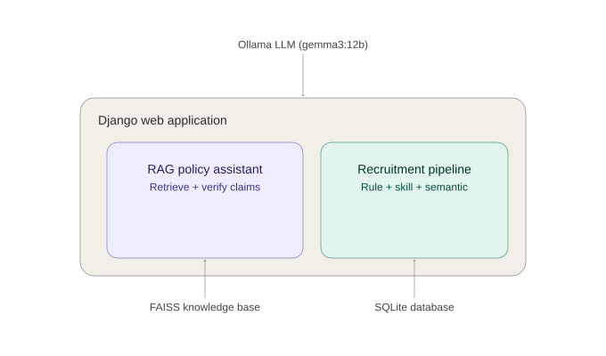
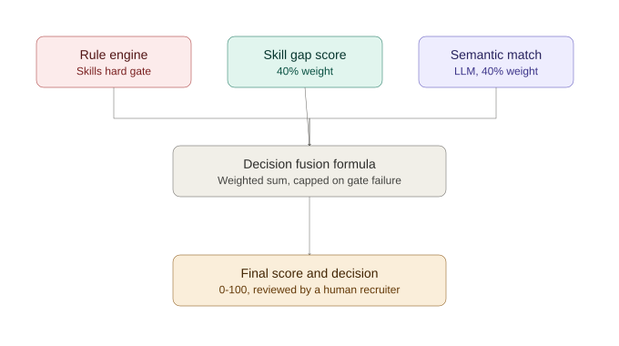

# Paper & Thesis Framework — AI Recruitment Decision Support System

Maps the built system, real benchmark data, and architecture to a
standard 12-chapter thesis structure. Tables and figures here are
ready to copy into the draft; prose framing is scaffolding for you
to write in your own voice, not a substitute for it.

---

## 1. Chapter-by-Chapter Mapping

| # | Chapter | What this project already gives you |
|---|---|---|
| 1 | Introduction | Problem framing: civil service recruitment in Timor-Leste is manual, slow, and hard to audit for fairness. State the thesis contribution up front: an AI decision-*support* (not decision-*making*) platform combining rule-based filtering, LLM semantic matching, and a policy RAG assistant, with Human-in-the-Loop enforced architecturally. |
| 2 | Problem Statement & Research Questions | Draw directly from the pipeline diagram (§3, Figure 1): RQ1 — can rule-based and LLM-based matching be fused into a single, defensible score? RQ2 — can a RAG system answer recruitment-policy questions without hallucinating on out-of-scope or temporal queries? RQ3 — where does each approach fail, and why? |
| 3 | Literature Review | Position against: (a) pure keyword/ATS matching systems (your Rule Engine improves on these but doesn't replace them), (b) black-box ML ranking (your system's counter-position is full explainability), (c) generic LLM chatbots for HR (your RAG groundedness/decomposition pipeline is the differentiator — cite this as the gap you fill). |
| 4 | Theoretical Framework | Human-in-the-Loop AI, explainable AI (XAI), retrieval-augmented generation, and evidence-based decision support. Your `ai_recruitment_policy.pdf` document itself is a primary source you can cite/quote as the governing policy framework. |
| 5 | System Requirements & Design Objectives | Derived directly from the Phase 1-6 audit trail: fairness (rule gate cannot be bypassed by semantic score), transparency (every score traces to visible evidence), security (auth-gated internal pages, validated uploads), reliability (no unhandled crashes on AI failure). |
| 6 | System Architecture & Design | **Figure 1** (system architecture) and **Figure 2** (decision fusion pipeline) below. Describe the two subsystems as functionally and architecturally separate — this separation is itself a design decision worth defending in the chapter. |
| 7 | Implementation | Reference concrete modules: `ai_engine/services/recruitment_pipeline.py` (fusion + audit provenance), `ai_engine/services/recruitment_rules.py` (rule engine + requirement-evidence matrix), `ai_engine/services/llm_reasoning.py` (Phase 20: fused semantic-matching + explainable-decision call, replacing two sequential baseline calls — baseline kept in `llm_semantic_matcher.py`/`llm_explainable_ai.py` for comparison), `ai_engine/services/rag_screening_context.py` (Phase 20: simplified single-call job-context retrieval, distinct from the full conversational pipeline), `rag/rag_pipeline.py` (AI Assistant pipeline: decomposition → retrieval → coverage → generation → groundedness — unchanged by Phase 20), `ai_engine/services/model_config.py` (single-point model selection: `gemma3:12b` baseline vs. `gemma3:4b` Phase 20 prototype), `talent/models.py::HumanDecision` (human-in-the-loop record). |
| 8 | Evaluation Methodology | The 40-question benchmark matrix (§2 below), its 5-category design, and the metrics: classification accuracy, grounded rate, false acceptance/rejection. Explicitly describe how questions were verified against the actual indexed corpus before being written — this is a methodological strength, state it as one. |
| 9 | Results | **Table 1 and Table 2** below — real data, N=40, zero pipeline errors, run 2026-09-05. |
| 10 | Discussion (incl. Limitations) | §4 below — the Partial Evidence category weakness and its traced root cause, the RAG-score fusion placeholder, the status-workflow UI gap. Presenting a diagnosed weakness with a concrete cause is stronger than an undisclosed one. |
| 11 | Conclusion & Recommendations | Summarize what worked (near-perfect hallucination resistance, working hard-gate fusion) and what's next (fixing the decomposition prompt, replacing the RAG placeholder weight, wiring a real status-change UI). |
| 12 | References & Appendices | The 6 source policy PDFs, this repository, and the raw benchmark JSON (`rag/evaluation/results/benchmark_20260905_114417.json`) as a data appendix. |

---

## 2. Evaluation Methodology Summary (for Chapter 8)

- **Corpus**: 366 chunks indexed via FAISS from 6 official Timor-Leste
  civil service documents (Civil Service Commission Law, Recruitment
  Law, Competency Framework, AI Recruitment Policy, Training Regime,
  and general civil service policy).
- **Benchmark design**: 40 questions across 5 categories (10/10/10/5/5),
  each checked against the actual indexed corpus content before being
  written, to avoid testing against claims the corpus cannot support.
- **Pipeline under test**: question decomposition → per-claim
  retrieval → evidence coverage scoring → generation → post-hoc
  groundedness verification.
- **Run conditions**: local Ollama, `gemma3:12b`, zero pipeline
  errors across all 40 questions (a precondition established after
  fixing an `UnboundLocalError` in `rag_pipeline.py` found during a
  prior, corrupted 30-question run).

---

## 3. Results (for Chapter 9)

### Figure 1 — System Architecture



A single Django application hosts two functionally independent
subsystems. The Recruitment Pipeline (rule engine, skill-gap
analysis, semantic matching) persists all state to SQLite. The RAG
Policy Assistant reads a static FAISS knowledge base and holds no
conversation history — each question is evaluated independently.
Both subsystems call the same local Ollama instance, but never call
each other; a policy question cannot resolve to a candidate score,
and vice versa (see the Partial Evidence discussion in §4 for why
this boundary matters).

### Figure 2 — Decision Fusion Pipeline



### Table 1 — RAG Benchmark Summary (N=40, real run, 2026-09-05)

| Metric | Value |
|---|---|
| Total Questions | 40 |
| Classification Accuracy | 72.5% |
| Supported Accuracy | 80.0% |
| Partial Accuracy | 20.0% |
| Unsupported Accuracy | 100.0% |
| Grounded Rate | 100.0% |
| Avg. Evidence Score | 0.28 |
| False Acceptance (count) | 0 |
| False Rejection (count) | 3 |

### Table 2 — Accuracy by Category

| Category | Correct / Total | Accuracy |
|---|---|---|
| Direct Evidence | 9/10 | 90.0% |
| Partial Evidence | 2/10 | 20.0% |
| Unsupported | 10/10 | 100.0% |
| Temporal | 5/5 | 100.0% |
| Recruitment-Specific | 3/5 | 60.0% |

**LaTeX (Table 1), ready to paste:**

```latex
\begin{table}[h]
\centering
\begin{tabular}{lr}
\hline
Metric & Value \\
\hline
Total Questions & 40 \\
Classification Accuracy & 72.5\% \\
Supported Accuracy & 80.0\% \\
Partial Accuracy & 20.0\% \\
Unsupported Accuracy & 100.0\% \\
Grounded Rate & 100.0\% \\
Avg. Evidence Score & 0.28 \\
False Acceptance (count) & 0 \\
False Rejection (count) & 3 \\
\hline
\end{tabular}
\caption{RAG evaluation summary (N=40)}
\end{table}
```

**LaTeX (Table 2):**

```latex
\begin{table}[h]
\centering
\begin{tabular}{lrr}
\hline
Category & Correct/Total & Accuracy \\
\hline
Direct Evidence & 9/10 & 90.0\% \\
Partial Evidence & 2/10 & 20.0\% \\
Unsupported & 10/10 & 100.0\% \\
Temporal & 5/5 & 100.0\% \\
Recruitment-Specific & 3/5 & 60.0\% \\
\hline
\end{tabular}
\caption{Accuracy by question category (N=40)}
\end{table}
```

### Decision Fusion Formula (for Chapter 7/9)

```
if rule_engine.eligible is False:
    final_score = min(0.4 x skill_match_score + 0.4 x semantic_score, 49)
else:
    final_score = 0.4 x skill_match_score + 0.4 x semantic_score + 0.2 x rag_score
```

`rag_score` is a live retrieval against the CSC legal/policy corpus,
run once per job at job-creation time and cached (see
`rag_screening_context.py`). It falls back to a fixed value (80)
only if that retrieval failed or returned no evidence. It is
constant across every applicant to the same job — see the
limitation noted in §4.2.

### Table 3 — Screening Pipeline Validation (Phase 17)

Validates the core screening pipeline (Rule Engine → Skill Gap →
Semantic Matching → RAG-informed Fusion → Requirement-Evidence
Matrix) against 12 known-answer seeded candidates (3 tiers x 4 job
titles). Run via `python manage.py evaluate_screening`.

| Check | Result |
|---|---|
| Strong/Medium tiers pass eligibility gate | 8/8 |
| Weak tier fails eligibility gate | 4/4 |
| Score ranking (Strong > Medium > Weak) | 4/4 |
| Hard-cap enforced on ineligible candidates (<=49) | 4/4 |
| Requirement-Evidence matrix populated | 4/4 |
| RAG legal evidence populated | 4/4 |
| **Total** | **28/28 (100%)** |

This complements Table 1/2 (RAG policy Q&A accuracy) with evidence
that the candidate-scoring layer itself behaves as designed — the
hard-gate cap and score-ordering guarantees hold across every seeded
job and tier, not just in isolated unit tests.

### Table 4 — Audit Trail Fields (Phase 18)

Every recommendation is fully traceable from a single `Application`
record — no separate audit-log table was needed, since the fields
already existed from Phases 11-15; Phase 18 added only `ai_provider`
and wired `ai_model`/`ai_version` to be set at run time instead of
sitting at their static defaults.

| Traced item | Source field |
|---|---|
| Candidate / Job / Application | `Application.candidate`, `.job`, `.id` |
| Timestamps | `applied_at`, `ai_processed_at` |
| LLM provider / model / pipeline version | `ai_provider`, `ai_model`, `ai_version` |
| Extracted candidate profile | `ai_profile` |
| Job requirement profile | `ai_job_profile` |
| Rule screening result | `ai_rule_result` |
| Requirement-evidence matrix | `ai_rule_result["matrix"]` |
| Semantic matching result | `ai_semantic_result` |
| RAG legal context/evidence | `ai_rag_context` |
| AI recommendation + confidence | `ai_decision`, `ai_confidence` |
| Human decision + reason + override flag | `HumanDecision.decision`, `.reason`, `.agreed_with_ai` |

Verified end-to-end (2026-09-05): one candidate, one job, full
pipeline run, human approval recorded, all fields above confirmed
present and correctly rendered on the Candidate Detail page's Audit
Trail card.

---

```
if rule_engine.eligible is False:
    final_score = min(0.4 x skill_match_score + 0.4 x semantic_score, 49)
else:
    final_score = 0.4 x skill_match_score + 0.4 x semantic_score + 0.2 x rag_score
```

`rag_score` is a live retrieval against the CSC legal/policy corpus,
run once per job at job-creation time and cached (see
`rag_screening_context.py`). It falls back to a fixed value (80)
only if that retrieval failed or returned no evidence. It is
constant across every applicant to the same job — see the
limitation noted in §4.2.

Implemented once, in `compute_final_score()`
(`ai_engine/services/recruitment_pipeline.py`), and imported by both
the live application pipeline and the demo-data seeder, so reported
scores are never computed two different ways.

---

### Table 5 — Model Comparison: Baseline vs. Phase 20 Prototype

Phase 20 replaced the inference model to make the system viable for
live demonstration on the target hardware (AMD Ryzen 5 5625U, 6
cores/12 threads, 16GB RAM, no usable GPU acceleration under Ollama
on this platform). The baseline run is preserved below, not
discarded, so both are available as research record.

| | BASELINE (Phase 1-19) | CURRENT PROTOTYPE (Phase 20) |
|---|---|---|
| Model | `gemma3:12b` | `gemma3:4b` |
| Run date | 2026-09-05 | 2026-09-07 |
| N | 40 | 40 |
| Classification Accuracy | 72.5% | 82.5% |
| Supported Accuracy | 80.0% | 93.3% |
| Partial Accuracy | 20.0% | 40.0% |
| Unsupported Accuracy | 100.0% | 100.0% |
| Grounded Rate | 100.0% | 95.0% |
| Avg. Evidence Score | 0.28 | 0.34 |
| False Acceptance | 0 | 0 |
| False Rejection | 3 | 1 |

### Table 6 — Accuracy by Category: Baseline vs. Phase 20 Prototype

| Category | Baseline (12b) | Phase 20 (4b) |
|---|---|---|
| Direct Evidence | 90.0% (9/10) | 100.0% (10/10) |
| Partial Evidence | 20.0% (2/10) | 40.0% (4/10) |
| Unsupported | 100.0% (10/10) | 100.0% (10/10) |
| Temporal | 100.0% (5/5) | 100.0% (5/5) |
| Recruitment-Specific | 60.0% (3/5) | 80.0% (4/5) |

**Framing for the thesis (stated deliberately, not just a headline
number):** these results show strong evidence grounding and
abstention behavior — unsupported-question rejection remains
perfect (100%) and false acceptance remains zero across both
models, meaning the system has not been observed to present
unsupported claims as fact under either configuration. Direct
evidence and temporal-guard performance are also strong under both
models. Partial-evidence classification remains the system's
clearest limitation (40% under the Phase 20 prototype, still the
weakest category despite improving from the 20% baseline) — the
root cause traced in Phase 4/Discussion §4.1 (the question
decomposition prompt splitting "assertion — but question?" phrasing
into claims less reliably than "X and Y?" phrasing) is the same
mechanism in both model configurations, so the smaller model did not
introduce a new failure mode here, it inherited an existing one. Do
not read the 82.5% headline number as "highly accurate" on its own —
it is a mean across categories with very different accuracy
profiles, and the category-level breakdown is more informative than
the aggregate.

**Grounded rate note:** the baseline's 100% grounded rate slipped to
95% under the smaller model — one answer in this run was not fully
grounded in retrieved evidence. This is worth a specific sentence in
the thesis limitations section rather than being absorbed into the
aggregate number, since groundedness is the property this whole
architecture exists to guarantee.

### Table 7 — End-to-End Performance Observation (Phase 20 prototype, `gemma3:4b`)

Manual dry-run, real Ollama, real corpus, single run (not yet
repeated for min/max/avg — treat as one observed data point, not a
statistical baseline).

| Step | Duration | Result | Notes |
|---|---|---|---|
| Create Job (incl. job profile extraction + RAG legal context, F2) | 29 sec | OK | Legal Reference Evidence populated (not empty/fallback) |
| Upload CV & Apply (incl. CV extraction + fused reasoning, F1) | 1 min 26 sec | OK | AI Score, AI Decision, Explainable Report all produced |
| Candidate Detail | — | OK | Normal |
| Human Review | — | OK | Normal |
| AI Assistant (normal question) | — | OK | Normal |
| AI Assistant (temporal guard question) | — | OK | Normal — abstention behavior preserved under the new model |

**Before/after context (qualitative, not a controlled comparison —
different model, different pipeline, single observations on each
side, not repeated trials):** prior to Phase 20 (F1+F2+model
change), individual LLM calls on `gemma3:12b` were reported to take
up to several minutes each, with full job-creation (4-6 sequential
RAG calls) and candidate screening (3 sequential calls) taking
correspondingly longer — see the Phase 20 architectural audit for
the call-count analysis. The Phase 20 prototype's Create Job (1 LLM
call, F2) and Upload/Apply (2 LLM calls, F1) completing in 29
seconds and 1 minute 26 seconds respectively is consistent with the
combined effect of fewer sequential LLM calls per operation (F1: 3→2,
F2: 4-6→1) and a smaller model (`gemma3:4b` vs `gemma3:12b`), but
this single dry-run does not isolate how much of the improvement
comes from each factor individually — a controlled ablation (same
model, old vs. new call count; same call count, old vs. new model)
was not run and should not be implied by this table.

---

## 4. Discussion — Limitations Worth Stating Yourself (for Chapter 10)

Disclosing these in your own words is stronger than an examiner
finding them unprompted.

**4.1 Partial Evidence detection (20% accuracy) — root cause traced.**
7 of 8 newly designed partial-evidence questions were misclassified,
following a consistent pattern: questions phrased as "[assertion] —
but [specific question]?" were not split into two separate claims by
the question-decomposition prompt, while questions phrased as
"[question] and [question]?" were split correctly. The decomposer's
few-shot examples only demonstrate the "and"-joined case (see
`rag/question_decomposer.py`). This is a precise, addressable
prompt-engineering gap, evidenced by `coverage: 0.0` scores despite
`retrieval_status: "supported"` — meaning relevant evidence *was*
retrieved but never credited at the claim level.

**4.2 The RAG term in the fusion formula is per-job, not per-candidate.**
The RAG Assistant queries the CSC legal/policy corpus once per job
(keyed on job title) at job-creation time, and every applicant to
that job shares the same cached evidence and score — this was
initially a fixed placeholder (80) and has since been replaced with
a live retrieval, but the retrieval itself still cannot vary by
individual candidate, since the query never sees a specific CV. It
answers "what does policy require for this type of role," not "how
well does this person comply." Extending it to a genuinely
per-candidate signal would require indexing candidate CVs into the
retrieval layer, which was deliberately not done, to preserve the
architectural separation between the two subsystems documented in
Figure 1.

**4.3 The candidate status workflow (pending → screening → ... →
accepted/rejected) has no dedicated control in the custom UI.** It is
functional today only via Django Admin. The data model and the
separation between AI-generated evidence and human-owned decisions
are both correct; only the front-end control is pending.

**4.4 Recruitment-Specific category (60%) and one Direct Evidence
question (DE08) also under-performed** — both traced to the same
decomposition-boundary issue in §4.1 rather than a separate cause,
which is itself worth stating: one root cause explains three
category-level weaknesses, not three unrelated bugs.

**4.5 LoRA fine-tuning (Phase 16) was scoped but not executed —
hardware-constrained by design, documented here rather than forced.**
Per the layered-architecture framework (Rule Engine / RAG / LLM /
LoRA as distinct roles, not substitutes), a LoRA specialist adapter
for recruitment-screening classification was planned as a natural
extension once Phase 11-15 stabilized. It was not attempted because:

- No dedicated GPU was available — only a laptop with no CUDA-capable
  device for training. LoRA reduces trainable *parameters*, not the
  memory/compute needed to run forward+backward passes through the
  frozen base weights, so even LoRA still needs meaningful VRAM for
  any model large enough to be worth adapting (realistically a
  smaller variant than the gemma3:12b used for inference — e.g.
  gemma3:1b/2b — would be the actual fine-tuning target, not the
  production model itself).
- CPU-only training of even a small model over a few hundred examples
  was estimated at many hours to multiple days per run, incompatible
  with the thesis timeline and with iterating on data quality (the
  Phase 5 dataset section already stresses quality/consistency over
  volume, which itself requires multiple training-evaluation cycles).
- Ollama does support serving a LoRA adapter for Gemma-family models
  via its `ADAPTER` Modelfile directive once trained elsewhere — so
  the *serving* path is not the blocker, only *training* is.

**Designed-but-not-executed experiment (ready to run given GPU
access):**

1. **Dataset**: `recruitment_screening_dataset.jsonl`, one record per
   labeled example: `{instruction, input (CV text + job profile),
   output: {education_match, experience_match, skill_match,
   language_match, decision, reasoning}}`. Source: human-validated
   corrections captured through the Phase 15 Human-in-the-Loop review
   (`HumanDecision` records, especially `agreed_with_ai=False`
   overrides — these are the highest-value examples, since they mark
   exactly where the current LLM+RAG pipeline needs correction).
2. **Target model**: a small Gemma 3 variant (1B/2B), not the 12B
   production model, fine-tuned via LoRA (PEFT) on a rented GPU
   instance (Colab/Kaggle) if pursued post-thesis.
3. **Evaluation**: compare LLM-only vs LLM+RAG (both already measured
   in this thesis, §3 Table 1/2) against a LoRA and LoRA+RAG
   condition, on the same 40-question-style held-out set, tracking
   accuracy, grounded rate, and hallucination rate.
4. **Honest framing for the defense**: this is future work with a
   concrete, executable design — not an unexplored idea — blocked
   purely by a disclosed hardware constraint, not by a design gap.

---

## 5. What's Ready vs. What You Still Need to Write

**Ready to use as-is:** both figures, both result tables (Markdown
and LaTeX), the fusion formula listing, the limitations list, the
raw JSON appendix (`rag/evaluation/results/benchmark_20260905_114417.json`).

**Still yours to write:** the actual prose for each chapter — the
literature review's citations, the theoretical framing's citations,
and the interpretive argument connecting your results to your
research questions. This document gives you the scaffolding and the
verified data; the academic argument built on top of it is the part
only you can write.
